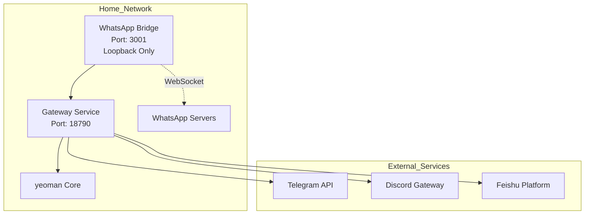
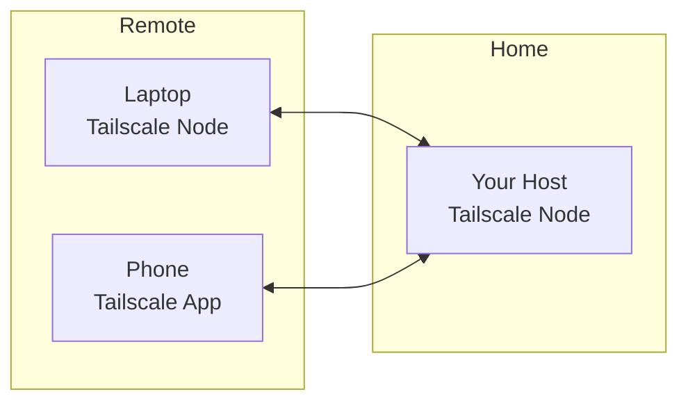
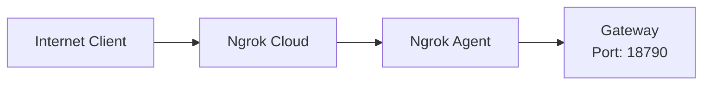
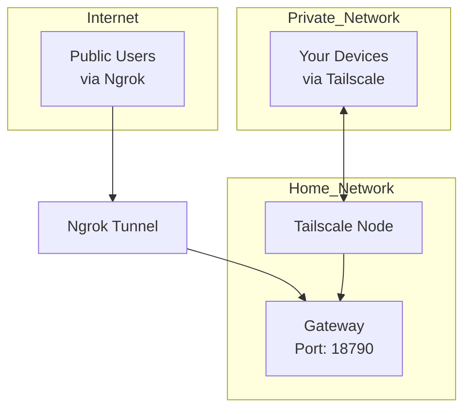
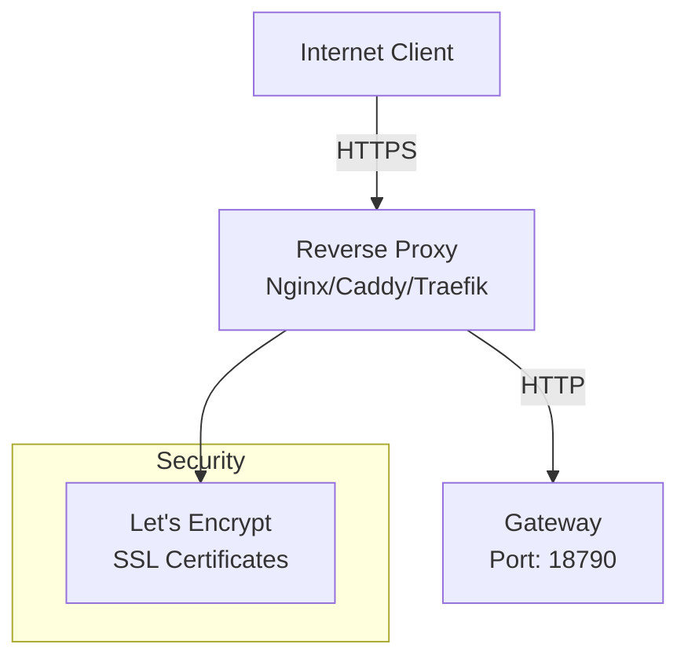
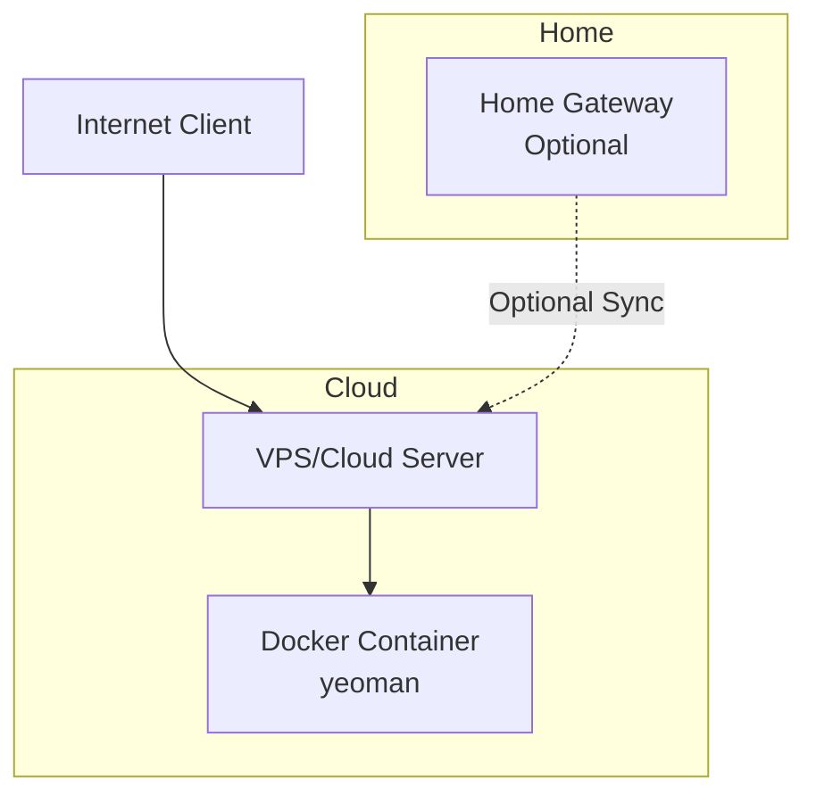

# External Access Options for yeoman

## Overview

Your yeoman project consists of:
- **Gateway Service**: Listens on port `18790` (configurable via `config.json`)
- **WhatsApp Bridge**: Listens on port `3001` (default, only accepts loopback connections)
- **Chat Channels**: Telegram, Discord, WhatsApp, Feishu

## Current Network Architecture



---

## Option 1: Port Forwarding (Simplest, Direct Access)

### Description
Forward ports from your router to your host machine to allow direct external access.

### Ports to Forward
| Service | Internal Port | External Port | Protocol |
|---------|---------------|---------------|----------|
| Gateway | 18790 | 18790 (or custom) | TCP |

### Pros
- No additional infrastructure required
- Direct control over access
- No monthly costs

### Cons
- Requires static public IP or DDNS
- Security risks (exposes service directly)
- ISP may block incoming connections
- Requires router configuration

### Implementation Steps
1. Set up DDNS (e.g., duckdns.org, no-ip.com) if you have dynamic IP
2. Configure router port forwarding:
   - External port: 18790 (or custom)
   - Internal IP: Your host's LAN IP
   - Internal port: 18790
3. Configure firewall to allow port 18790
4. Access via: `ws://your-ddns-domain:18790` or `http://your-ddns-domain:18790`

### Security Considerations
- **CRITICAL**: The WhatsApp bridge (port 3001) is **hardcoded to accept loopback only** - do NOT forward this port
- Implement authentication at application level
- Use fail2ban or similar to block brute force attempts
- Consider using a reverse proxy with SSL/TLS

---

## Option 2: Cloud Tunneling (Recommended, Secure)

### 2a. Cloudflare Tunnel (Zero Trust)

```mermaid
flowchart LR
    Client[Internet Client] --> CF[Cloudflare Edge]
    CF --> CF Tunnel[Cloudflare Tunnel<br/>cloudflared]
    CF Tunnel --> GW[Gateway<br/>Port: 18790]
```

#### Description
Use Cloudflare Tunnel to create a secure, outbound-only connection to Cloudflare's network.

#### Pros
- No public IP required
- Automatic SSL/TLS
- Zero Trust security controls
- DDoS protection
- No router configuration needed
- Free tier available

#### Cons
- Requires Cloudflare account
- Dependent on Cloudflare service

#### Implementation Steps
1. Install cloudflared:
   ```bash
   # Ubuntu/Debian
   wget -q https://github.com/cloudflare/cloudflared/releases/latest/download/cloudflared-linux-amd64.deb
   sudo dpkg -i cloudflared-linux-amd64.deb
   ```

2. Authenticate:
   ```bash
   cloudflared tunnel login
   ```

3. Create tunnel:
   ```bash
   cloudflared tunnel create yeoman-tunnel
   ```

4. Configure tunnel (`~/.cloudflared/config.yml`):
   ```yaml
   tunnel: <your-tunnel-id>
   credentials-file: /home/user/.cloudflared/<tunnel-id>.json

   ingress:
     - hostname: yeoman.yourdomain.com
       service: http://localhost:18790
     - service: http_status:404
   ```

5. Run as service:
   ```bash
   sudo cloudflared service install
   sudo systemctl start cloudflared
   sudo systemctl enable cloudflared
   ```

6. Access via: `https://yeoman.yourdomain.com`

---

### 2b. Tailscale (VPN-like Mesh Network)



#### Description
Use Tailscale to create a private, encrypted mesh network between your devices.

#### Pros
- End-to-end encryption
- No public IP required
- Works behind NAT
- Easy setup (one command)
- Free for personal use (up to 100 devices)
- Built-in SSH access

#### Cons
- Requires Tailscale client on all accessing devices
- Not accessible from arbitrary web clients

#### Implementation Steps
1. Install Tailscale:
   ```bash
   curl -fsSL https://tailscale.com/install.sh | sh
   ```

2. Authenticate:
   ```bash
   sudo tailscale up
   ```

3. Access from another device:
   ```bash
   # On remote device
   tailscale up
   # Then access: http://<tailscale-ip>:18790
   ```

4. Optional: Enable Funnel for public access (beta):
   ```bash
   sudo tailscale funnel 18790
   # Access via: https://<tailscale-name>.ts.net
   ```

---

### 2c. Ngrok (Quick Testing)



#### Description
Use ngrok to quickly expose your gateway to the internet for testing.

#### Pros
- Zero configuration
- Works immediately
- Free tier available
- Automatic HTTPS
- No router changes needed

#### Cons
- Free tier has limitations (random URL, connection limits)
- Not suitable for production
- Paid tier required for custom domains
- URL changes on each restart (free tier)

#### Implementation Steps
1. Install ngrok:
   ```bash
   # Linux
   curl -s https://ngrok-agent.s3.amazonaws.com/ngrok.asc | sudo tee /etc/apt/trusted.gpg.d/ngrok.asc >/dev/null
   echo "deb https://ngrok-agent.s3.amazonaws.com buster main" | sudo tee /etc/apt/sources.list.d/ngrok.list
   sudo apt update && sudo apt install ngrok
   ```

2. Authenticate:
   ```bash
   ngrok config add-authtoken YOUR_TOKEN
   ```

3. Start tunnel:
   ```bash
   ngrok http 18790
   ```

4. Access via the URL shown (e.g., `https://abc1-234-567-890.ngrok-free.app`)

#### Ngrok vs Tailscale - Key Differences

| Feature | Ngrok | Tailscale |
|---------|-------|-----------|
| **Access Type** | Public internet access | Private mesh network |
| **Who Can Access** | Anyone with the URL | Only devices in your Tailscale network |
| **Authentication** | Optional (basic auth) | Built-in device authentication |
| **URL Stability** | Changes on restart (free) | Stable `*.ts.net` domain |
| **Best For** | Public web services, testing | Private device-to-device access |
| **Mobile Access** | Via web browser | Via Tailscale app |
| **Cost** | Free tier limited | Free for personal use (100 devices) |

---

### 2d. Combining Ngrok + Tailscale (Hybrid Approach)



#### Use Case
- Use **Tailscale** for your personal devices (phone, laptop, work computer) - private, secure access
- Use **Ngrok** for temporary public access when needed (testing with friends, demos)

#### Implementation

1. **Set up Tailscale for personal access** (see section 2b above)
   - Install Tailscale on your home host
   - Install Tailscale on your personal devices
   - Access via: `http://<tailscale-ip>:18790`

2. **Set up Ngrok for temporary public access** (when needed)
   ```bash
   # Start ngrok only when you need public access
   ngrok http 18790
   ```

3. **Stop ngrok when done** - Tailscale continues working for your private access

#### Benefits
- **No Tailscale needed on home network for public access** - ngrok works independently
- **Tailscale provides secure private access** for your devices
- **Ngrok provides quick public access** when needed
- **Both can run simultaneously** if needed

#### Can You Skip Tailscale in Your Home Network?

**Yes!** Here are your options:

| Scenario | Solution | Tailscale on Home? |
|----------|----------|-------------------|
| Personal device access only | Use Tailscale on all devices | ✅ Yes |
| Public web access only | Use Ngrok or Cloudflare Tunnel | ❌ No |
| Both personal + public | Use both (Tailscale for private, Ngrok for public) | ✅ Yes (optional) |
| Personal + public (simpler) | Use Cloudflare Tunnel with Zero Trust access controls | ❌ No |

**Recommendation**: If you only need occasional public access, **skip Tailscale on your home network** and just use:
- **Ngrok** for quick, temporary public access (free, easy)
- **Cloudflare Tunnel** for more permanent public access with security controls (free, more robust)

Use Tailscale only if you want secure, private access between your specific devices without exposing anything to the public internet.

---

## Option 3: Reverse Proxy with SSL/TLS (Production-Ready)



### Description
Set up a reverse proxy with SSL termination in front of your gateway.

### Pros
- SSL/TLS encryption
- Centralized access control
- Load balancing capability
- Can host multiple services
- Production-ready

### Cons
- Requires public IP or DDNS
- More complex setup
- Requires SSL certificate management

### Implementation with Caddy (Simplest)

1. Install Caddy:
   ```bash
   sudo apt install -y debian-keyring debian-archive-keyring apt-transport-https
   curl -1sLf 'https://dl.cloudsmith.io/public/caddy/stable/gpg.key' | sudo gpg --dearmor -o /usr/share/keyrings/caddy-stable-archive-keyring.gpg
   curl -1sLf 'https://dl.cloudsmith.io/public/caddy/stable/debian.deb.txt' | sudo tee /etc/apt/sources.list.d/caddy-stable.list
   sudo apt update
   sudo apt install caddy
   ```

2. Configure Caddy (`/etc/caddy/Caddyfile`):
   ```
   yeoman.yourdomain.com {
       reverse_proxy localhost:18790
   }
   ```

3. Restart Caddy:
   ```bash
   sudo systemctl restart caddy
   ```

4. Access via: `https://yeoman.yourdomain.com`

### Implementation with Nginx (More Control)

1. Install Nginx and Certbot:
   ```bash
   sudo apt install nginx certbot python3-certbot-nginx
   ```

2. Configure Nginx (`/etc/nginx/sites-available/yeoman`):
   ```nginx
   server {
       listen 80;
       server_name yeoman.yourdomain.com;
       
       location / {
           proxy_pass http://localhost:18790;
           proxy_http_version 1.1;
           proxy_set_header Upgrade $http_upgrade;
           proxy_set_header Connection "upgrade";
           proxy_set_header Host $host;
           proxy_set_header X-Real-IP $remote_addr;
           proxy_set_header X-Forwarded-For $proxy_add_x_forwarded_for;
           proxy_set_header X-Forwarded-Proto $scheme;
       }
   }
   ```

3. Enable and get SSL:
   ```bash
   sudo ln -s /etc/nginx/sites-available/yeoman /etc/nginx/sites-enabled/
   sudo nginx -t
   sudo systemctl reload nginx
   sudo certbot --nginx -d yeoman.yourdomain.com
   ```

---

## Option 4: VPS/Cloud Hosting (Most Reliable)



### Description
Deploy yeoman to a VPS or cloud service with a public IP.

### Pros
- Always available
- Static public IP
- Professional infrastructure
- Can scale resources
- Better uptime

### Cons
- Monthly cost ($5-20/month typical)
- Requires server management
- May need to sync data from home

### Implementation Steps

1. Choose a VPS provider:
   - DigitalOcean ($6/month)
   - Linode ($5/month)
   - Hetzner (~€4/month)
   - AWS Lightsail ($5/month)

2. Deploy yeoman:
   ```bash
   # SSH into VPS
   ssh user@your-vps-ip
   
   # Clone and install
   git clone https://github.com/dimitree2k/yeoman.git
   cd yeoman
   pip install -e .
   
   # Or use Docker
   docker build -t yeoman .
   docker run -d -v ~/.yeoman:/root/.yeoman -p 18790:18790 yeoman gateway
   ```

3. Configure firewall:
   ```bash
   sudo ufw allow 22/tcp    # SSH
   sudo ufw allow 18790/tcp # Gateway
   sudo ufw enable
   ```

4. Access via: `http://your-vps-ip:18790` or with reverse proxy as above

---

## Option 5: Use Existing Chat Platforms (No Network Changes Required!)

### Description
Leverage yeoman's built-in chat platform integrations which don't require exposing ports.

### Platform Options

| Platform | Network Requirement | Setup Difficulty |
|----------|-------------------|------------------|
| **Telegram** | Outbound only | ⭐ Easy |
| **Discord** | Outbound only | ⭐ Easy |
| **Feishu** | WebSocket (outbound) | ⭐⭐ Medium |
| **WhatsApp** | Outbound + local bridge | ⭐⭐ Medium |

### Pros
- **No router configuration needed**
- No public IP required
- Built-in authentication
- Works from anywhere
- Mobile apps available

### Cons
- Dependent on third-party platforms
- Platform-specific limitations
- Requires platform accounts

### Implementation

#### Telegram (Recommended - Easiest)
```json
// ~/.yeoman/config.json
{
  "channels": {
    "telegram": {
      "enabled": true,
      "token": "YOUR_BOT_TOKEN"
    }
  }
}
```

Run: `yeoman gateway`

Access: Open Telegram, find your bot, and chat!

#### Discord
```json
// ~/.yeoman/config.json
{
  "channels": {
    "discord": {
      "enabled": true,
      "token": "YOUR_BOT_TOKEN"
    }
  }
}
```

Run: `yeoman gateway`

Access: Invite bot to your server and chat!

#### Feishu (No Public IP Required!)
```json
// ~/.yeoman/config.json
{
  "channels": {
    "feishu": {
      "enabled": true,
      "appId": "cli_xxx",
      "appSecret": "xxx"
    }
  }
}
```

Run: `yeoman gateway`

Access: Chat with your Feishu bot!

#### WhatsApp
```bash
# Terminal 1: Link device
yeoman channels login

# Terminal 2: Start gateway
yeoman gateway
```

Access: Chat with your linked WhatsApp number!

---

## Security Best Practices

### For Any External Access Method

1. **Authentication**: Always implement authentication at the application level
2. **Rate Limiting**: Prevent brute force attacks
3. **HTTPS/TLS**: Always use encrypted connections
4. **Firewall**: Only expose necessary ports
5. **Updates**: Keep yeoman and dependencies updated
6. **Monitoring**: Monitor access logs for suspicious activity
7. **Backup**: Regular backups of `~/.yeoman` directory

### Specific to yeoman

1. **WhatsApp Bridge Security**: The bridge (port 3001) is **hardcoded to accept loopback only** - do NOT expose this port externally
2. **Policy Configuration**: Use `~/.yeoman/policy.json` to control access per chat
3. **Workspace Restriction**: Enable `tools.restrictToWorkspace` in production
4. **Exec Isolation**: Consider enabling `tools.exec.isolation.enabled` for Linux

```json
// ~/.yeoman/config.json - Production settings
{
  "tools": {
    "restrictToWorkspace": true,
    "exec": {
      "isolation": {
        "enabled": true
      }
    }
  }
}
```

---

## Comparison Summary

| Option | Cost | Complexity | Reliability | Best For |
|--------|------|------------|-------------|----------|
| Port Forwarding | Free | Medium | Low | Testing, temporary access |
| Cloudflare Tunnel | Free | Low | High | Production, secure access |
| Tailscale | Free | Low | High | Personal device access |
| Ngrok | Free/Paid | Very Low | Medium | Quick testing |
| Reverse Proxy | Free | High | High | Production, custom domain |
| VPS Hosting | $5-20/mo | Medium | Very High | Always-on, professional |
| Chat Platforms | Free | Very Low | High | Most users, no network config |

---

## Recommendation

### For Personal Use
**Use Chat Platforms (Telegram/Discord)** - No network configuration required, works from anywhere with mobile apps.

### For Development/Testing
**Use Cloudflare Tunnel or Tailscale** - Secure, no public IP needed, easy to set up.

### For Production
**Deploy to VPS with Cloudflare Tunnel** - Reliable, scalable, professional infrastructure with Zero Trust security.

---

## Configuration Reference

### Gateway Port Configuration

Edit `~/.yeoman/config.json`:
```json
{
  "gateway": {
    "host": "0.0.0.0",
    "port": 18790
  }
}
```

### WhatsApp Bridge Configuration

Edit `~/.yeoman/config.json`:
```json
{
  "channels": {
    "whatsapp": {
      "enabled": true,
      "bridge_url": "ws://localhost:3001",
      "bridge_host": "127.0.0.1",
      "bridge_port": 3001,
      "bridge_token": "your-token"
    }
  }
}
```

**IMPORTANT**: The bridge server only accepts loopback connections (`127.0.0.1`). Do NOT forward port 3001 or change `bridge_host` to `0.0.0.0` for external access.

---

## Troubleshooting

### Connection Refused
- Check if gateway is running: `yeoman status`
- Verify firewall settings: `sudo ufw status`
- Check port is listening: `sudo netstat -tlnp | grep 18790`

### SSL Certificate Issues
- Ensure domain DNS points correctly
- Check Certbot logs: `sudo journalctl -u certbot`
- Renew manually: `sudo certbot renew`

### Cloudflare Tunnel Not Working
- Check tunnel status: `cloudflared tunnel info <tunnel-id>`
- Verify DNS records in Cloudflare dashboard
- Check cloudflared logs: `journalctl -u cloudflared`

### Tailscale Connection Issues
- Check Tailscale status: `sudo tailscale status`
- Verify firewall allows Tailscale: `sudo ufw allow 41694/udp`
- Re-authenticate: `sudo tailscale up --reset`

---

## Additional Resources

- [yeoman README](../README.md)
- [Cloudflare Tunnel Docs](https://developers.cloudflare.com/cloudflare-one/connections/connect-apps/)
- [Tailscale Docs](https://tailscale.com/kb/)
- [Caddy Server](https://caddyserver.com/docs/)
- [Let's Encrypt](https://letsencrypt.org/docs/)
